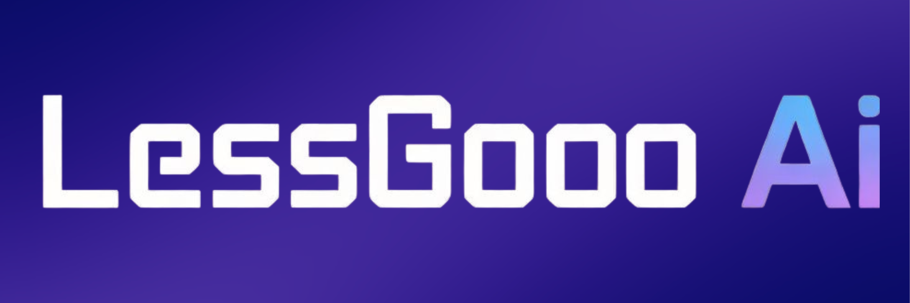

  

LESSGOOO AI is a modern AI-powered web platform that allows users to:
- Generate AI videos
- Enroll in AI Masterclass training
- Learn how to use Artificial Intelligence for productivity and income

The platform is built as a static website and hosted using GitHub Pages.

---

## 🌍 Live Website

🔗 https://rano1000.github.io/lessgooo/

---

## 🎯 Features

### 🤖 AI Video Generator
Users can access an AI-powered video generation interface.

### 🎓 AI Masterclass
A structured AI training program covering:
- AI foundations
- AI for productivity
- AI content creation
- AI for business & side hustles
- AI automation workflows
- Practical AI projects

### ⏳ 30-Day Countdown Timer
Limited offer countdown with real-time seconds display.

### 💬 WhatsApp Enrollment System
Users enroll via WhatsApp with automatic pre-filled messages.
Supports bilingual messaging (English / French).

### 🌍 Language Support
Website supports:
- English
- French

WhatsApp auto-message dynamically updates based on selected language.

---

## 🛠 Tech Stack

- HTML5
- CSS3
- JavaScript
- GitHub Pages (Hosting)
- WhatsApp API (Redirect System)

---

## 🏗 Project Structure

lessgooo/
│
├── README.md
├── index.html
├── ai-generator.html
├── masterclass.html
│
├── logo.png
├── video.mp4
│
├── index.css
├── home.css
├── masterclass.css
│
├── script.js
├── home.js
├── masterclass.js

---

## 🚀 Deployment

The project is deployed using GitHub Pages.

To deploy:
1. Push files to main branch
2. Enable GitHub Pages in repository settings
3. Select main branch as source

No backend or server required.

---

## 🔒 Access Model

- Website hosted on GitHub
- Payments handled manually via WhatsApp
- AI access granted after payment confirmation

---

## 📌 Disclaimer

LESSGOO AI is an independent AI education and AI tool platform.  
Access to AI services may depend on third-party provider availability.

---

## 👨‍💻 Author

LESSGOO AI Team  
Built with passion for AI innovation 🚀
